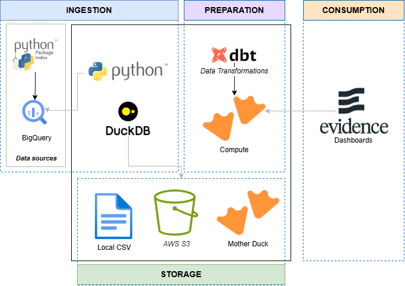
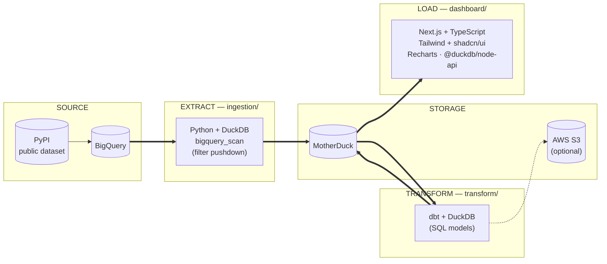

# Pypi Package Stats : Get insights of your python project 🐍 

An end-to-end data engineering project built with **Python**, **DuckDB**, **dbt**, and **MotherDuck** — ingesting raw data, transforming it into analytics-ready models, and serving it through a dashboard.


## High-level architecture






The project is a monorepo composed of three parts:

- **Ingestion** — under `ingestion/`: pulls raw data with Python + DuckDB and loads it into MotherDuck (and/or S3).
- **Transformation** — under `transform/`: dbt (`dbt-duckdb` adapter) models the raw data into clean, query-ready tables.
- **Visualization** — under `dashboard/`: a front end that queries MotherDuck directly and renders the results.

---

## Tech Stack

| Layer          | Tool                                   |
|----------------|-----------------------------------------|
| Language       | Python 3.12                             |
| Local engine   | [DuckDB](https://duckdb.org/)           |
| Transformation | [dbt](https://www.getdbt.com/) (`dbt-duckdb` adapter) |
| Warehouse      | [MotherDuck](https://motherduck.com/)   |
| Dependency mgmt| [uv](https://github.com/astral-sh/uv)   |
| Task runner    | Make                                    |
| Dashboard      | Node.js front end querying MotherDuckb (Evidence)  |

---

## Project Structure

```
.
├── docs/                   # Diagrams, screenshots, architecture image
├── ingestion/               # Python ingestion pipeline
├── transform/                # dbt project
│   └── <project>_metrics/
├── dashboard/                # Front end that queries MotherDuck using evidence
├── Makefile                  # Pipeline shortcuts
├── env.template               # Environment variable template
├── pyproject.toml
└── README.md
```

---

## Getting Started

### Prerequisites

- Python 3.12
- [uv](https://github.com/astral-sh/uv) for Python package management
- [Make](https://www.gnu.org/software/make/manual/make.html)
- Node.js (only needed for the dashboard)
- A [MotherDuck](https://app.motherduck.com/) account and token

### Setup

```bash
git clone https://github.com/Anass-NB/pypi-package-stats.git
cd pypi-package-stats
```

Use `.env.template` as a template file for `.env` and fill your env variables by: 
- get the json file of the gcp to get the data from bigquery 
- if are using motherDuck get your token from motherDuck UI
- Fill your project name and other variables like database name , start and end date , destination storage ...
- if you're using s3 as a data lake make sure to setup your aws creds 

### Environment

Copy the template and fill in your values:

```bash
cp env.template .env
```

```env
DATABASE_NAME=<motherduck_database_name>
START_DATE=2024-01-01
END_DATE=2024-12-31
motherduck_token=<your_motherduck_token>
TRANSFORM_S3_PATH_OUTPUT=s3://your-bucket/output/   # optional
AWS_PROFILE=default                                  # optional
```

---

## Usage

**Ingestion**

```bash
make ingest
make ingest-test
```

**Transformation (dbt)**

```bash
make transform START_DATE=2024-01-01 END_DATE=2024-01-31 DBT_TARGET=dev   # local DuckDB
make transform START_DATE=2024-01-01 END_DATE=2024-01-31 DBT_TARGET=prod  # MotherDuck
make transform-test
```

**Dashboard**

```bash
cd dashboard
npm install
npm run dev   # http://localhost:3000
```

---

## Roadmap

- [x] Local ingestion pipeline (Python + DuckDB)
- [x] dbt transformation layer with dev/prod targets
- [x] Dashboard for visualizing results
- [ ] CI/CD for automated dbt runs and tests
- [ ] Orchestration : Schedule the data pipeline to be daily running
- [ ] Deploy data pipeline 
- [ ] Deploy dashboard (e.g. Vercel)
- [ ] write Unit tests for ingestion and transformation layers


---

## Author

**Anass Nabil** — Data Engineer
[GitHub](https://github.com/Anass-NB) · [LinkedIn](https://linkedin.com/in/anassnabil) · [anaz.me](https://anaz.me)